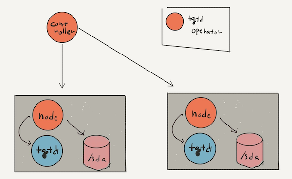

tgtd-operator
=============


tgtd-operator is a light-weight Kubernetes Operator that operates tgt daemon to manage iSCSI Target, LUN, Account, Initiator.

Architecture
------------

tgtd-operator consits of two component, one is controller and the other is node agent.



### tgtd-operator controller

Controller component manages InitiatorGroup to maintain initiator list from latest node list.

### tgtd-operator node

Node agent communicates with tgt daemon using tgtadm cli, so node agent should be placed on each nodes where tgtd is running. And node agent uses Target/InitiatorGroup/InitiatorGroupBinding/Account CRD which are stored in Kubernetes apiserver instead of using `/etc/tgt/targets.conf`.

Concepts
--------

### Target

Target is a representation of iSCSI Target which consits of LUNs.

```yaml
apiVersion: tgtd.unstable.cloud/v1alpha1
kind: Target
metadata:
  name: target-sample
spec:
  // nodeName is a node name where the target will be placed.
  nodeName: storage-node
  // iqn is an iqn of the target
  iqn: iqn.2020-04.cloud.unstable.example:target
  // luns is a list of LUNs
  luns:
    // lun is an id of the LUN
  - lun: 1
    // backingStore is a path of the backing store
    backingStore: /dev/sda1
  - lun: 2
    backingStore: /dev/sdb1
    bsType: aio
```

### InitiatorGroup

InitiatorGroup is a group of iSCSI initiators. It has nodeSelector to create initiator group from Node objects and so it means InitiatorGroup dynamically discover initiator groups.
Usually, it should not to set `nodeSelector` because all nodes want to be initiator.

```yaml
apiVersion: tgtd.unstable.cloud/v1alpha1
kind: InitiatorGroup
metadata:
  name: initiator-group-sample
spec:
  addresses: ["192.168.1.0/24", "192.168.2.0/24"]
  nodeSelector:
    "initiator-group": "group1"
  initiatorNameStrategy:
    type: NodeName
    initiatorNamePrefix: "iqn.2020-06.cloud.unstable.tgtd.init"
```

"initiator name" is decided by InitiatorGroup from node name or annotation.
If you specify `.spec.initiatorNameStrategy.type` to `NodeName` and `spec.initiatorNameStrategy.initiatorNamePrefix` to `iqn.2020-06.cloud.unstable.tgtd.init`, "initiator name" is generated from node name and then it become `iqn.2020-06.cloud.unstable.tgtd.init:${NODE_NAME}`.
Or, if you specify `.spec.initiatorNameStrategy.type` to `Annotation` and `.spec.initiatorNameStrategy.AnnotationKey`, "initiator name" is decided to it's annotation value.

### InitiatorGroupBinding

InitiatorGroupBinding binds a Target with a InitiatorGroup directly. If the binding succeeds, tgtd-operator tries to bind target with initiator using `tgtadm` utility.

Sample configuration is below.

```yaml
apiVersion: tgtd.unstable.cloud/v1alpha1
kind: InitiatorGroupBinding
metadata:
  name: initiator-group-binding-sample
spec:
  targetRef:
    Name: target-sample
  initiatorGroupRef:
    Name: initiator-group-sample
```

Installation
------------

tgtd-operator runs within your Kubernetes cluster as a series of deployment resources. It utilizes `CustomResourceDefinitions` to configure iSCSI Targets and Initiators.

It is deployed using regular YAML manifests, like any other application on Kubernetes.

```bash
$ kubectl kustomize "github.com/yuanying/tgtd-operator.git/config/default?ref=master" | kubectl apply -f -
```

Usually, there are only a few nodes where you want to install tgtd as an iSCSI Target Node. This manifest assumes such cases. Please label your node where you want to install tgtd like following.

```bash
$ kubectl label node ${TGTD_NODE} tgtd.unstable.cloud/storage=
```

If tgtd-operator is installed successfully, you can see 2 pods in tgtd-operator-system namespace like this.

```bash
$ kubectl get pod -n tgtd-operator-system -o wide
NAME                                        READY   STATUS    RESTARTS   AGE    IP              NODE            NOMINATED NODE   READINESS GATES
tgtd-operator-controller-5445568d9f-6z8zt   2/2     Running   0          5h4m   10.244.3.109    172.18.13.123   <none>           <none>
tgtd-operator-node-2j5nf                    2/2     Running   0          7s     172.18.13.125   ${TGTD_NODE}    <none>           <none>
```

They are controller and node agent.

Node agent contains tgt daemon, so you don't need to install tgt daemon separately. Of course you can install your own tgt daemon and run node agent, but it's outside the scope of this document.

Usage
-----

### InitiatorGroup

First of all, let's set up the InitiatorGroup.

```bash
$ cat <<EOF | kubectl apply -f -
apiVersion: tgtd.unstable.cloud/v1alpha1
kind: InitiatorGroup
metadata:
  name: initiator-group-sample
spec:
  addresses: ["172.18.0.0/16"]
  initiatorNameStrategy:
    type: NodeName
    initiatorNamePrefix: "iqn.2020-04.cloud.unstable"
EOF
```

tgtd-operator discover nodes and registers them as an initiator. You can check registered initiators from InitiatorGroup status.

```bash
$ kubectl get initiatorgroup initiatorgroup-sample -o yaml
apiVersion: tgtd.unstable.cloud/v1alpha1
kind: InitiatorGroup
metadata:
  creationTimestamp: "2020-06-28T05:58:52Z"
  generation: 1
  name: initiatorgroup-sample
  resourceVersion: "29054593"
  selfLink: /apis/tgtd.unstable.cloud/v1alpha1/initiatorgroups/initiatorgroup-sample
  uid: 57baaa51-fdd7-41d5-8112-590c86c2fbd0
spec:
  addresses:
  - 172.18.0.0/16
  initiatorNameStrategy:
    initiatorNamePrefix: iqn.2020-04.cloud.unstable
    type: NodeName
status:
  addresses:
  - 172.18.0.0/16
  initiators:
  - iqn.2020-04.cloud.unstable:node01
  - iqn.2020-04.cloud.unstable:node02
  - iqn.2020-04.cloud.unstable:node03
  - iqn.2020-04.cloud.unstable:node04
  - iqn.2020-04.cloud.unstable:storage01
```

In this case, you can see that five nodes were found as an initiator.

### Target

The iSCSI target can be set up from the Target object. Let's create it.

```bash
$ cat <<EOF | kubectl apply -f -
apiVersion: tgtd.unstable.cloud/v1alpha1
kind: Target
metadata:
  name: target-sample
spec:
  nodeName: storage01
  iqn: iqn.2020-06.cloud.unstable:target1
  luns:
  - backingStore: /dev/zvol/tank/vol0
    lun: 1
```

-   `nodeName` is the name of the node where the target is placed. It must be the same as the name of the node labeled in Installation section.
-   `iqn` is the IQN of the iSCSI target. It must be a unique name.
-   `luns` is the spec of Logical Unit Numbers.
    -   `lun` is the number of LUN. It must start from 1.
    -   `backingStore` is the path of the device or the file which you want to publish.

If iSCSI target is setup successfully, you can see `Ready` status.

```bash
$ kubectl get target target-sample -o yaml
apiVersion: tgtd.unstable.cloud/v1alpha1
kind: Target
metadata:
  creationTimestamp: "2020-06-28T06:11:06Z"
  finalizers:
  - target.tgtd.unstable.cloud/cleanup
  generation: 1
  name: target-sample
  resourceVersion: "29171024"
  selfLink: /apis/tgtd.unstable.cloud/v1alpha1/targets/target-sample
  uid: 84312de1-73d4-4916-b66b-9f38388f7e25
spec:
  iqn: iqn.2020-06.cloud.unstable:target1
  luns:
  - backingStore: /dev/zvol/tank/vol0
    lun: 1
  nodeName: storage01
status:
  conditions:
  - lastTransitionTime: "2020-06-28T07:22:22Z"
    status: "False"
    type: TargetFailed
  - lastTransitionTime: "2020-06-28T07:22:22Z"
    status: "False"
    type: LUNFailed
  - lastTransitionTime: "2020-06-28T07:22:22Z"
    status: "True"
    type: Ready
  observedGeneration: 1
  observedState:
    acls: []
    iqn: iqn.2020-06.cloud.unstable:target1
    luns:
    - backingStore: None
    - backingStore: /dev/zvol/tank/vol0
      lun: 1
    tid: 1
```

### InitiatorGroupBinding

Finally, bind your target with initiators. After of all, you can use iSCSI target from registered initiators (nodes).

```bash
$ cat <<EOF | kubectl apply -f -
apiVersion: tgtd.unstable.cloud/v1alpha1
kind: InitiatorGroupBinding
metadata:
  name: initiatorgroupbinding-sample
spec:
  initiatorGroupRef:
    name: initiatorgroup-sample
  targetRef:
    name: target-sample
EOF
```
